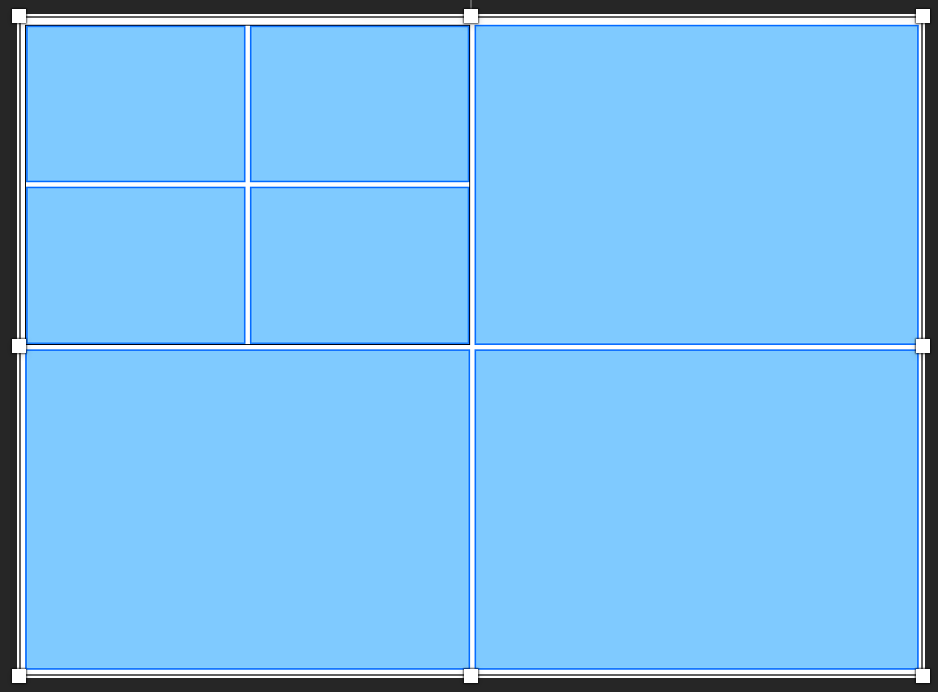

# This is the finished code for the Front End Developer Tech Challenge

This Tech challenge is created initially with GraphQL server and Svelte Js. 

Server api: https://rnd-ns2-tech-challenge-next-be.vercel.app/api/graphql

## Graphql

### To query users from server:

```
   query ($page: Int, $pageSize: Int, $username: String) {
    Users(pagination: {page: $page, pageSize: $pageSize}, filter: {username: $username}) {
      data {
        id
        username
        companies {
        id
        name
        rooms {
          id
          name
        }
      }
      }
      meta {
        pagination {
          page
          pageSize
          totalOfPage
          totalOfRecord
        }
      }
    }
  }
```
with variables:
```
{
  "page": 2,
  "pageSize": 20
}
```

### To create a new user
```
  mutation ($username: String!) {
    createUser(username: $username) {
      id
      username
    }
  }
```
with variables:
```
{
	"username": "New User"
}
```

### Question 1

The Users list in frontend shows mock data; Please modify the code; so it can display the users from graphql server `https://rnd-ns2-tech-challenge-next-be.vercel.app/api/graphql` with pagination

### Question 2

There is the mutation to create a new user; please extend the Users component so the users can add the new user by opening a new modal

### Question 3

Let improve the UI of the app by:
- Create a home page with a header, collapsible left side menu bar and main content area.
- Left side menu show the options: Home and Users
- Home page ( ): within the main content area, we would like you to create a responsive grid that fully fits within its container. Within that responsive grid should be another grid in its first cell.


